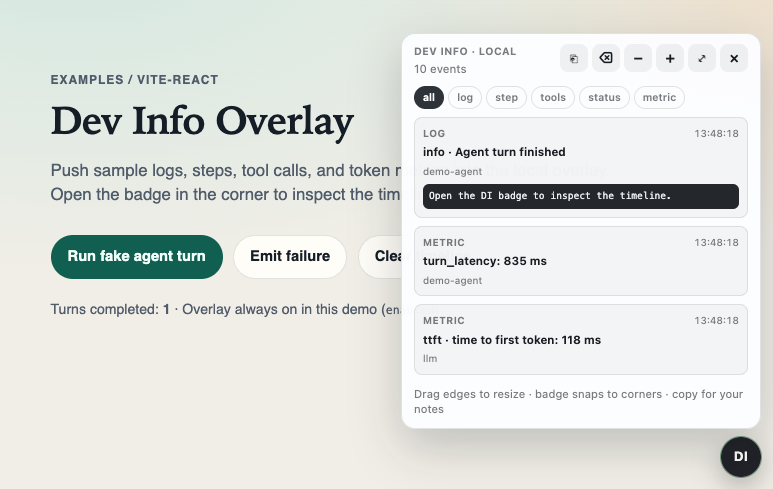

# Install for agents (copy from GitHub)

Public entry for coding agents and humans who want Dev Info Overlay **without cloning this monorepo** and **without npm / GitHub Packages**.

Repo: [github.com/sdrth/dev-info-tools](https://github.com/sdrth/dev-info-tools)

## What you get

A local-only React overlay for **logs · steps · tool calls · metrics** during development. Drop the source into any React 18+ TypeScript app and push events with `devInfo.*`.



## What agents should do

1. Open this file or the install skill on GitHub.
2. Use the raw base below (or derive `OWNER` / `REPO` / `REF` from the page URL).
3. Follow **Mode GITHUB** in the install skill — download listed files into `vendor/dev-info-overlay/`.
4. Wire aliases, mount `<DevInfoOverlay enabled={…} />`, gate with `DEV_INFO_OVERLAY=1`.
5. Keep the skills in the host repo so future agents reuse the workflow.

### Canonical raw URLs (`main`)

```text
https://raw.githubusercontent.com/sdrth/dev-info-tools/main/dev-info-overlay/skills/install-and-use-dev-info-overlay/SKILL.md
https://raw.githubusercontent.com/sdrth/dev-info-tools/main/dev-info-overlay/skills/emit-dev-info-traces/SKILL.md
```

```text
RAW=https://raw.githubusercontent.com/sdrth/dev-info-tools/main
```

### Source files to vendor

Exact remote → local map is in the install skill. Summary:

```text
dev-info-overlay/src/*.{ts,tsx,css}  →  vendor/dev-info-overlay/
```

Do not invent or rewrite the modules. If a raw fetch 404s, check the branch/tag.

## Optional: npm

Only after the package is published and `npm view dev-info-overlay` succeeds. Until then, **vendoring from GitHub is the supported path**.

## Demo (optional)

```bash
git clone https://github.com/sdrth/dev-info-tools.git
cd dev-info-tools
pnpm install
pnpm demo
```

## License

MIT — see [`LICENSE`](./LICENSE). Vendored copies should retain the copyright notice.
